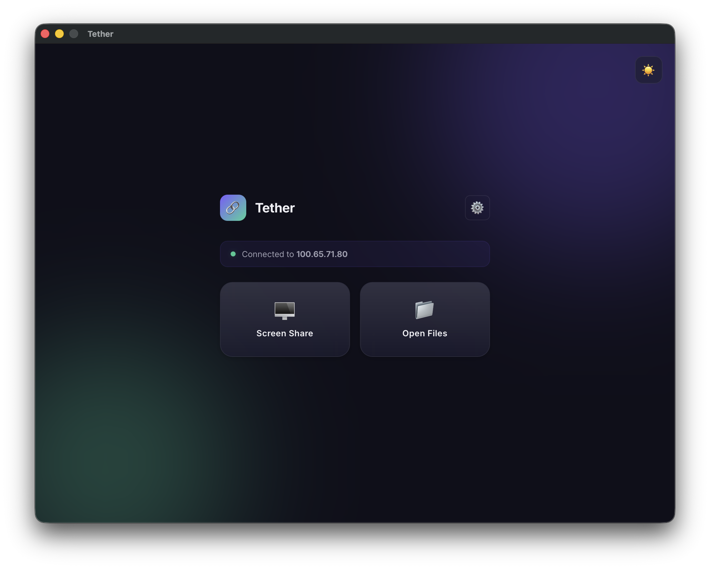

# Tether
A lightweight desktop assistant to quickly connect to your home server for screen sharing, file access, and port scanning.



[**Download Latest Release**](https://github.com/codertg2/tether/releases)

## Quick start

```bash
git clone https://github.com/codertg2/tether.git
cd tether
wails dev
```

## Features

- **Quick Connection Setup**: Connect to your server's IPv4 address or `.local` hostname with automatic background validation.
- **Screen Sharing (VNC)**: One-click access to open a VNC screen-sharing session with your home server.
- **File Browser (SMB)**: One-click access to mount and open your server's file system via SMB.
- **Secure Credential Storage**: Passwords are stored in the macOS Keychain rather than in plain text.
- **Modern UI/UX**: A beautiful glassmorphism design with animated background orbs and Dark/Light mode support.

## How to run it locally

**System dependencies**:
- macOS (for `open` command and Keychain integration)
- Go 1.18+
- Node.js & npm
- Wails CLI (`go install github.com/wailsapp/wails/v2/cmd/wails@latest`)

**Commands**:
```bash
# Install Go dependencies
go mod tidy

# Start the application in development mode
wails dev
```

## How it works

Tether relies on the native macOS `open` command to handle `vnc://` and `smb://` protocols, delegating the complex connection handling to the OS. For security, Tether avoids plain text files by hooking directly into the macOS Keychain via the `go-keyring` library.

## Credits / acknowledgements

- Built with the [Wails](https://wails.io/) framework for seamless Go and web integration.
- Powered by [go-keyring](https://github.com/zalando/go-keyring) for native credential management.
